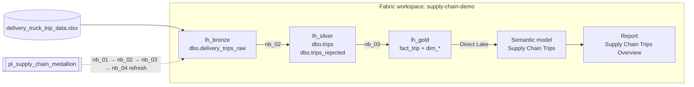
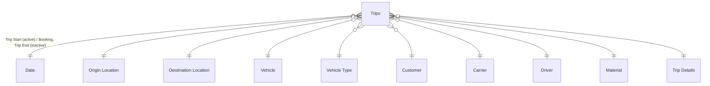

# Supply Chain Demo: Medallion Architecture on Microsoft Fabric

End-to-end demo that takes raw **delivery truck trip** data from Bronze → Silver → Gold in
Fabric lakehouses and serves it through a **Direct Lake semantic model** built as a proper
Power BI star schema, with a one-page report on top.

Dataset: [Delivery truck trips data](https://www.kaggle.com/datasets/ramakrishnanthiyagu/delivery-truck-trips-data)
(Kaggle, ~6.9K bookings across India, 2019–2020). A copy is in [`data-source/`](data-source/).

## Demo scope

| In scope | Out of scope |
|---|---|
| Bronze ingest with lineage columns (append-only batches) | Streaming / incremental CDC |
| Silver cleansing, typing, de-duplication, quarantine table | Row-level security |
| Gold Kimball star schema (1 fact, 10 dimensions) | Multiple environments (dev/test/prod) |
| Direct Lake semantic model with measures and hierarchies | Data quality alerting |
| Orchestration pipeline + one-page Power BI report | |

## Architecture



| Layer | Notebook | What it does |
|---|---|---|
| Bronze | `nb_01_bronze_ingest` | Reads `Files/raw_data/*.xlsx` as-is (all strings) and appends a batch with `_source_file`, `_batch_id`, `_ingestion_timestamp`. |
| Silver | `nb_02_silver_transform` | Latest batch → typed, snake_case, one row per `booking_id`. Treats `NULL`/`NA` as nulls, drops the Excel zero date, parses `Place, City, State` (PIN codes stripped, missing state inferred from the city), normalises vehicle types, derives delivery status and durations, and adds DQ flags. Rows it can't use go to `trips_rejected`. Drops PII (driver phone). |
| Gold | `nb_03_gold_star_schema` | Star schema with integer surrogate keys, an `Unknown` (-1) member in every dimension, V-Order, and orphan-key validation. |
| Serve | `nb_04_refresh_semantic_model` | Reframes the Direct Lake model after Gold loads (Semantic Link). |

> The lakehouse's auto-generated `dbo.raw_data` table (shortcut transform over the xlsx) is left
> untouched. It loses most Excel datetime values, so Bronze reads the file directly.

## Semantic model: *Supply Chain Trips*



- **Direct Lake** on `lh_gold`; single-direction one-to-many relationships on integer keys.
- **Date** is a marked date table that plays three roles: trip start (active), plus booking and trip end (inactive, used through `USERELATIONSHIP` in the measures).
- **Origin and Destination Location** are role-playing copies of one conformed location dimension. **Trip Details** is a junk dimension (booking type, GPS provider, delivery status).
- Keys and aggregated columns are hidden and implicit measures are disabled. Every visible object has a description. The model has hierarchies for Calendar, Origin and Destination Geography, and Vehicle Classification.
- 20 measures on `Trips`, grouped into display folders:
  - **Volume**: Trips, Completed and Open Trips, Trips by Booking Date, Completed Trips by End Date, MoM %, YTD
  - **Delivery Performance**: On-Time %, Delayed %
  - **Distance & Time**: Total and Average Distance, Average Trip Duration, Average Transit Time
  - **Fleet & Partners**: Active Vehicles, Trips per Vehicle, Active Customers, Active Carriers

## Repository layout

```
data-source/                      raw Kaggle files
fabric/notebooks/                 4 PySpark notebooks (.ipynb)
fabric/semantic-model/            TMDL for "Supply Chain Trips" (Direct Lake)
fabric/report/                    PBIR for "Supply Chain Trips Overview"
fabric/pipeline/                  pipeline definition
scripts/deploy.py                 idempotent deploy via Fabric REST API
```

## Run it

Prerequisites: a Fabric capacity workspace, Azure CLI signed in (`az login`), and Python 3.10+.

1. Create a schema-enabled lakehouse named `lh_bronze` and upload `data-source/delivery_truck_trip_data.xlsx` to `Files/raw_data/`.
2. Deploy everything and run the pipeline:
   ```bash
   python scripts/deploy.py --workspace supply-chain-demo --run
   ```
   This creates `lh_silver` and `lh_gold`, plus the notebooks, semantic model, report and pipeline, and resolves every ID by name. Re-running it updates items in place.
3. Open **Supply Chain Trips Overview** in the workspace.

Options: use `--only notebooks semantic-model` to redeploy specific parts, and `--run-notebooks nb_02_silver_transform` to run notebooks directly.

## Expected results

| Check | Value |
|---|---|
| Bronze rows per batch | 6,880 |
| Silver trips / rejected / duplicates removed | 6,873 / 2 / 5 |
| `fact_trip` rows, orphan keys | 6,873, 0 |
| Model: Trips · On-Time % · Active Vehicles | 6,873 · 36.8% · 2,312 |
